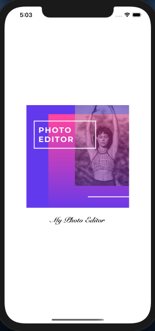

# ImageEditor
#### ImageEditor is an Application where user can view pictures and modify them by adding filters. 
##Technologies used
--
 - Swift.
 - RESTful API.
 - Alamofire.
 - SDWebImage.
 - MVC Pattern.
 - Cocoa pods.

--

